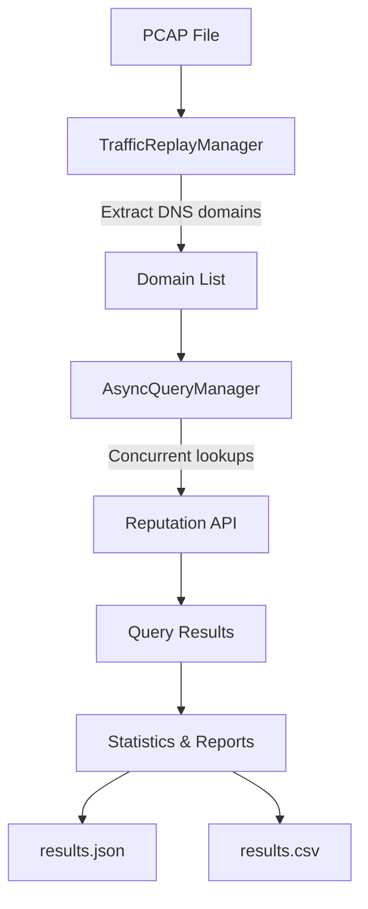

# DNS Reputation Analysis Tool

## Project Overview
This tool analyzes DNS traffic from PCAP files, extracts unique domains, and checks their reputation using an external API.  
It supports asynchronous high-throughput queries, caching, real-time monitoring, graceful shutdown, and structured reporting in both JSON and CSV formats.

---

## Key Features
- **Traffic Replay**: Replays DNS traffic from PCAP files.
- **Domain Extraction**: Identifies unique domains from DNS queries.
- **Asynchronous Reputation Engine**: Performs concurrent lookups using `aiohttp`.
- **Caching**: Avoids duplicate lookups for previously processed domains.
- **Monitoring**: Displays real-time statistics (QPS, errors, response times).
- **Graceful Shutdown**: Handles Ctrl+C or timeout events cleanly.
- **Reporting**: Saves results in **JSON and CSV** formats.

---
## Workflow




## Installation

1. Clone the repository:
   ```bash
   git clone <your-private-repo-url>
   cd dns-reputation-analysis


2. Create a virtual environment and install dependencies:
    python -m venv venv
    source venv/bin/activate   # Linux/MacOS
    venv\Scripts\activate      # Windows

    pip install -r requirements.txt


Usage:
1. Prepare a PCAP file containing DNS queries (e.g., pcap_single.pcap).
2. Run the tool:
   python main.py 
   Add the correct file "Enter the path to the pcap file (empty is default): "    

3. During execution you will see:
   Extracted domains from the PCAP file
   Reputation results from the API
   Live statistics (queries per second, errors, etc.)

4. Once completed, results are saved to:
   results.json

Results Format
    Example JSON output:

    ```json[
    {
        "domain": "2.1.168.192.in-addr.arpa",
        "reputation": 0,
        "categories": {},
        "stats": {
            "malicious": 0,
            "suspicious": 0,
            "undetected": 32,
            "harmless": 63,
            "timeout": 0
        }
        }
    ]```

Main Files
1. main.py – Entry point of the application.
2. traffic_manager.py – Reads PCAP files and extracts domains.
3. async_queries.py – Manages asynchronous requests with retry and caching.
4. reputation_engine.py – Queries the Reputation API and stores results.
5. utils.py – Utility functions (graceful shutdown, statistics, save JSON).

System Requirements
1. Python 3.10+
2. Active internet connection (for Reputation API access)
3. PCAP file containing DNS traffic


Example Output

    --- Final Statistics ---
    Packets processed: 3210
    Domains processed: 593
    Errors encountered: 2
    Query rate (QPS): 15.6

 
Results saved to:

    results.json
    results.csv

Future Improvements
1. Add richer CSV fields (e.g., geolocation, ASN info).
2. Integrate with Grafana/Prometheus for advanced monitoring.
3. Improve rate limiting and request throttling.
4. Support multiple reputation providers with configurable backends.


